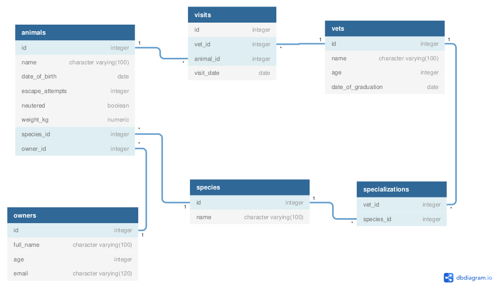

 

# Vet Clinic Database

> This project consists of a relational database which contains the data structure for a vet clinic.

## Getting Started

This repository includes files with plain SQL that can be used to recreate a database:

- Use [schema.sql](./schema.sql) to create all tables.
- Use [data.sql](./data.sql) to populate tables with sample data.
- Check [queries.sql](./queries.sql) for examples of queries that can be run on a newly created database. **Important note: this file might include queries that make changes in the database (e.g., remove records). Use them responsibly!**

## Authors

👤 **Nacho Sala**

- GitHub: [@nachosala89](https://github.com/nachosala89)
- Twitter: [@nachosala89](https://twitter.com/nachosala89)
- LinkedIn: [Juan Ignacio Sala](https://www.linkedin.com/in/nacho-sala)

👤 **Ajayi Peter**

- GitHub: [@peterdgreat](https://github.com/peterdgreat)
- Twitter: [@dev_peter_O](https://twitter.com/dev_peter_O)
- LinkedIn: [ajayipeter](https://www.linkedin.com/in/ajayipeter)

👤 **Luís Fernando**

- GitHub: 
- Twitter: 
- LinkedIn: 

## 🤝 Contributing

Contributions, issues, and feature requests are welcome!

Feel free to check the [issues page](../../issues/).

## Show your support

Give a ⭐️ if you like this project!

## Acknowledgments

- Microverse

## 📝 License

This project is [MIT](./MIT.md) licensed.
